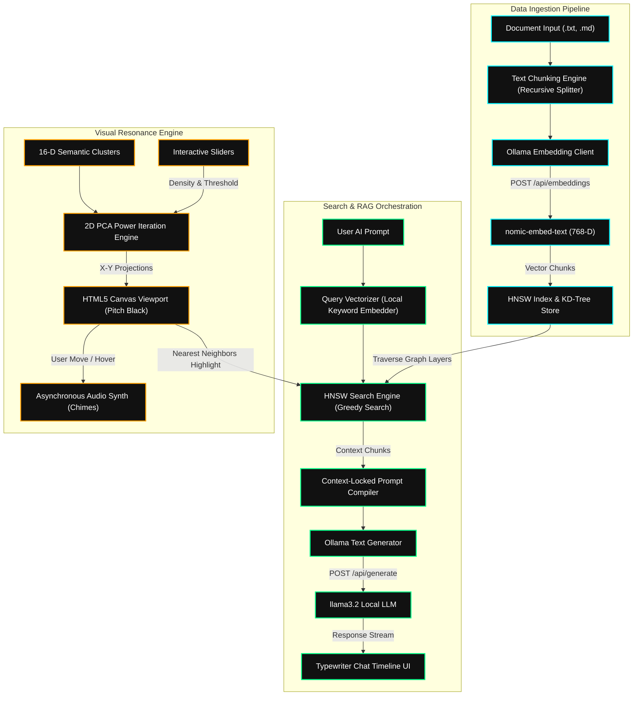

# 🧠 SYNAPSE — Neural Vector Engine

Welcome to **SYNAPSE**, a premium, high-performance local AI playground that couples a custom **HNSW (Hierarchical Navigable Small World) / KD-Tree Vector Database Engine** in Java with an interactive, beautifully glowing **2D Spatial Canvas Projection Viewport** and a fully integrated **Local RAG Chatbot**. 

Designed with a high-contrast, gallery-grade **Monochromatic Pitch Black & Gallery White Aesthetic**, SYNAPSE offers real-time coordinate projections, dynamic dual-theme switching, and elegant synthesized audio feedback.

---

## 🏛️ System Architecture Design

SYNAPSE is architected as an offline-first RAG (Retrieval-Augmented Generation) playground. It integrates Java-based vector indexing structures with dynamic client-side dimensionality reduction algorithms and browser-native Audio APIs.

### Architecture Workflow Diagram



---

## 📐 Detailed Core Components

### 1. High-Performance HNSW & KD-Tree Vector DB
* **Traversal Algorithm**: Compare brute-force search ($O(N)$) against structured KD-Tree multi-dimensional indices and high-speed **HNSW graph index structures** ($O(\log N)$). 
* **HNSW Greedy Graph Search**: Traverses layers of hierarchical proximity graphs. It starts at top-level entry points and jumps between nodes until reaching a local minimum, then transitions to the next layer down to continue search refinement.
* **Vector Metrics**: Supports multiple distance metric dimensions:
  * **Cosine Similarity**: $\text{sim}(u,v) = \frac{u \cdot v}{\|u\| \|v\|}$
  * **Euclidean Distance**: $d(u,v) = \sqrt{\sum (u_i - v_i)^2}$
  * **Manhattan Distance**: $d(u,v) = \sum |u_i - v_i|$
* **Categorical Clusters**: Memory-cached indices for Computer Science, Mathematics, Food/Cooking, and Sports nodes with automatic 16-D dimension weights and keyword profile mapping.

### 2. PCA Dimensionality Reduction Mathematics
* **Power Iteration PCA**: To display high-dimensional vectors on a 2D canvas, SYNAPSE implements a server/client-side **PCA Power Iteration** solver:
  1. Computes mean coordinates of the high-dimensional profiles and subtracts them to center the dataset ($X$).
  2. Iteratively calculates the first principal component vector ($PC_1$) by multiplying the covariance matrix until convergence: $v_{k+1} = \frac{X^T X v_k}{\|X^T X v_k\|}$.
  3. Orthogonalizes the dataset relative to $PC_1$ and repeats power iteration to isolate the second principal component ($PC_2$).
  4. Project vectors onto $PC_1$ (X-axis) and $PC_2$ (Y-axis) coordinate spaces dynamically.
* **Swarming Particles**: Stardust particles orbit coordinate nodes using dynamic boundary physics, scaling in real-time based on density parameters and proximity search distance thresholds.

### 3. Asynchronous Polyphonic Audio Synthesizer
* **Web Audio Synthesis**: Bypasses browser autoplay restrictions using modern, promise-based AudioContext clocks.
* **Asynchronous Timeline Sync**:
  ```javascript
  audioCtx.resume().then(() => {
    // Schedules precise volume envelope ramps safely on running clocks
    gainNode.gain.setValueAtTime(0.0001, now);
    gainNode.gain.linearRampToValueAtTime(maxVolume, now + attack);
    gainNode.gain.exponentialRampToValueAtTime(0.0001, now + release);
  });
  ```
  This guarantees that the internal audio buffer timer has successfully transitioned to `running` and started ticking *before* any chime nodes are scheduled, resolving silent frame glitches on mobile/desktop browsers.
* **Resonant Chime Chords**: Plays organic warm sine chords mapping frequency notes to node categories (CS, Math, Food, Sports, Docs) upon hover movements.

### 4. Interactive Local RAG Orchestration
* **Document Ingestion**: Segments `.txt` or `.md` documents into clean, overlapping recursive text chunks. Computes 768-D semantic vector coordinates locally via Ollama `nomic-embed-text` embeddings and indexes them inside the HNSW store.
* **Prompt Compilation**: During a chatbot prompt query, retrieves the top-$k$ nearest context document fragments via HNSW, constructs a context-locked prompt template, and pipes it to local **Llama 3.2** to stream typewriter answers.
* **Ollama Live Badging**: Permanent status checks in the sidebar reporting Ollama availability, Gen model, Embed model, indexed documents, and dimensions.

### 5. Monochromatic contrast Blending (Zero Bounding Boxes)
* **🌓 Dual Theme**: Toggle between pitch black (`#0a0a0a`) and gallery white (`#f7f7f9`) monochromatic palettes. choice persists across refreshes using `localStorage`.
* **Contrast-Locked Blending**: PNG icons are styled with custom CSS blending filters:
  * **Dark Mode**: `filter: contrast(200%) brightness(80%); mix-blend-mode: screen;`
  * **Light Mode**: `filter: invert(1) contrast(200%) brightness(120%); mix-blend-mode: multiply;`
  This pushes near-black background channels to absolute black and near-white channels to absolute white, rendering the PNG bounding boxes completely transparent and leaving only pure white outlines (dark theme) or pure black outlines (light theme).

---

## 🕹️ Detailed User Operation Guide

SYNAPSE is organized into three specialized, dynamic flexbox workspaces. Follow this guide to utilize each module:

### 1. Ingesting & Segmenting Knowledge Documents
1. Navigate to the **Knowledge Documents** tab in the top navbar.
2. In the left panel under **Index Knowledge Document**, write a clear title (e.g. `neural-nets`) and paste your text content in the body.
3. *Alternative (Drag & Drop)*: Drag a `.txt` or `.md` file directly into the dotted **Ingestion Drop Zone** to load the text instantly.
4. Click **Embed & Index Document**. The system will recursive-split the document, calculate 768-dimensional Ollama vectors, and cache them inside the HNSW store.
5. In the right panel, you will see your new card added under **Active Knowledge Fragments**, reporting word count and preview clips. You can delete segments by clicking `✕`.

### 2. Probing & Fine-Tuning the 2D Spatial Projections
1. Navigate to the **Vector Visualizer** tab in the top navbar.
2. Under **Visual Mode**, select **2D Space** to load the HTML5 coordinate grid.
3. Hover your mouse over the glowing cluster nodes to hear synthesized sine chimes corresponding to their semantic fields (CS notes emit a sharp blue chime, Math is green, Food is orange, Sports is purple, and Documents are warm pink).
4. **Slide System Parameters**:
   * **Similarity Threshold**: Restructure the orbit boundaries of floating particle swarms in real-time.
   * **Cluster Density**: Contract or expand the polar grouping manifolds of UMAP or t-SNE projections.
5. **Dimensionality Reduction**: Click `PCA`, `t-SNE`, or `UMAP` to watch the clusters instantly shift positions as coordinates are dynamically recalculated.
6. **Search Probe**:
   * Type a keyword (e.g. `algorithm`) in the search bar and click **Search Probe**.
   * An organic, curved Bezier connecting line will bridge your white Query Star to its closest nearest neighbors on the grid.
   * Review distance scores at the bottom list under **Nearest Neighbors**.
   * Click the **✕ icon** inside the search bar to clear your query, focus the input, and gracefully reset the graphs, list outputs, and telemetry curves back to baseline.

### 3. Local RAG AI Timeline
1. Navigate to the **AI Chatbot** tab.
2. In the bottom textarea box, type a prompt (e.g., `What is HNSW logic?`) and hit **Enter** to send immediately (or `Shift + Enter` to type new lines).
3. The RAG pipeline will trace nearby document fragments in the HNSW database, update the status indicators, compile context chunks, and stream a typewriter response from Llama 3.2.
4. In the response bubble, click on the **#1 Context Reference** chip layers to expand and read the exact background texts used by the LLM to generate the answer.

---

## 🔮 Future Scope & Possibilities

SYNAPSE serves as a modular framework for modern vector databases. The following integrations represent powerful potential extensions:

### 1. Multi-Modal CLIP Vector Indexing
* Expand the database model to support image files. By connecting backend ingestion to a local **CLIP model**, users can index images alongside text blocks, enabling cross-modal queries (e.g., searching for "peaceful lake" to retrieve coordinate hits pointing to image assets).

### 2. Live HNSW Hyperparameter Tuning
* Integrate graphical knobs to control HNSW engine parameters dynamically:
  * **$M$ (Max number of bidirectional connections per node)**.
  * **$efConstruction$ (Construction search depth queue size)**.
  * **$efSearch$ (Query search depth queue size)**.
* Visualizing the physical HNSW edges dynamically breaking and rebuilding in the Vis.js Graph as these parameters are tuned will show how index density directly scales query accuracy versus search latency.

### 3. Sparse & Dense Hybrid Retrieval (RRF)
* Implement a hybrid retrieval system combining dense semantic HNSW vectors with sparse **BM25 keyword search** algorithms. Utilizing **Reciprocal Rank Fusion (RRF)** to combine coordinate weights results in extremely robust context chunk retrieval, especially for highly technical documents.

### 4. Interactive Synthesizer Scaling
* Allow users to select specific musical scales (e.g., *Pentatonic*, *Harmonic Minor*, *Phrygian*) and oscillator waves (*Triangle*, *Sawtooth*, *Square*) in the settings sidebar. This turns vector proximity searches into an absolute creative playground of customized, generative soundscapes!

### 5. Raft-Backed Distributed Graph Clusters
* Scale the local database into a distributed cluster. By using the **Raft consensus protocol**, multiple nodes running SYNAPSE can coordinate, replica-sync HNSW index shards, and perform parallel queries over distributed networks with robust failover tolerances.

---

## 🛠️ Technology Stack

* **Backend**: Java, Spring Boot, Gradle, Web MVC.
* **Frontend**: Vanilla HTML5, CSS3, Javascript, Vis.js Network, Space Grotesk Google Fonts.
* **Local LLM Engine**: Ollama (retrieval-augmented generation).

---

## 🚀 Quick Start Guide

### **Step 1: Setup Local Ollama Models**
Make sure Ollama is installed and running on your system, then pull the necessary models for vector embedding and generation:
```bash
# Pull the vector embeddings model
ollama pull nomic-embed-text

# Pull the lightweight language model
ollama pull llama3.2
```

### **Step 2: Launch the Spring Boot Server**
From the root directory, compile and start the backend service:
```bash
./gradlew bootRun
```
*The server will initialize and automatically seed the database with 20 categorical vector nodes.*

### **Step 3: Open the Playground**
Go to your browser and open:
👉 **[http://localhost:8080](http://localhost:8080)**

*Tip: Perform a **Hard Reload** (`Cmd + Shift + R` or `Ctrl + F5`) to make sure all cached stylesheets update immediately.*
